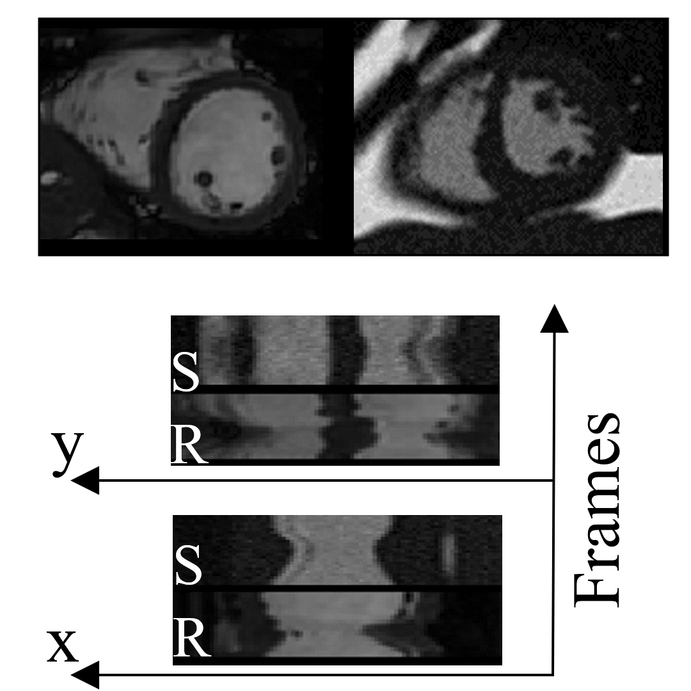

# [Paper]()
## **A Framework for Simulating Cardiac MR Images with Varying Anatomy and Contrast**

#### Sina Amirrajab, Yasmina Al Khalil, Cristian Lorenz, Jurgen Weese, Josien Pluim, Fellow, IEEE, and Marcel Breeuwer.

---
#### Dynamic cine simulation for 25 frames across one cardiac cyclewith 1 second period. Time profiles along x and y lines for simulated (S)  and  real  (R)  images  are  shown.
